# EASYJAM <br/>Web application for finding a like-minded person to jam with based on instruments, genres, gender, age and distance

## Description
This is my final project for the web development bootcamp from https://upleveled.io/.

Go through the list of matching results or jump into a swiping mode. Update searching criteria. Switch off the visibility status not to be displayed in the searching results. Check other users profiles and update yours at any time. Start a conversation and check the suggested closest rehearsal studio for 2 users.


## Functionalities

- Multi-step registration form
- User authentication (registration and login)
- User authorisation (API only allows the account owner to modify or delete info)
- CSRF mitigation using one of the token validation techniques suggested by OWASP
- Logout, user info update and user delete
- Mutual matching based on user profiles (2-step process in PostgreSQL)
- 2 Discovery modes (list view and swiping mode)
- Chat built with Ably
- Suggestion of the closest rehearsal studio for 2 users
- Possibility to check other users’ profiles, keep yours up to date and update profile’s visibility status

## Screenshots

| Landing page                                                    | Filters                                                | List of Results                                                        |
| --------------------------------------------------------------- | ------------------------------------------------------ | ---------------------------------------------------------------------- |
| 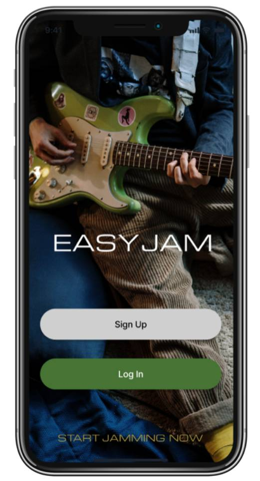 | 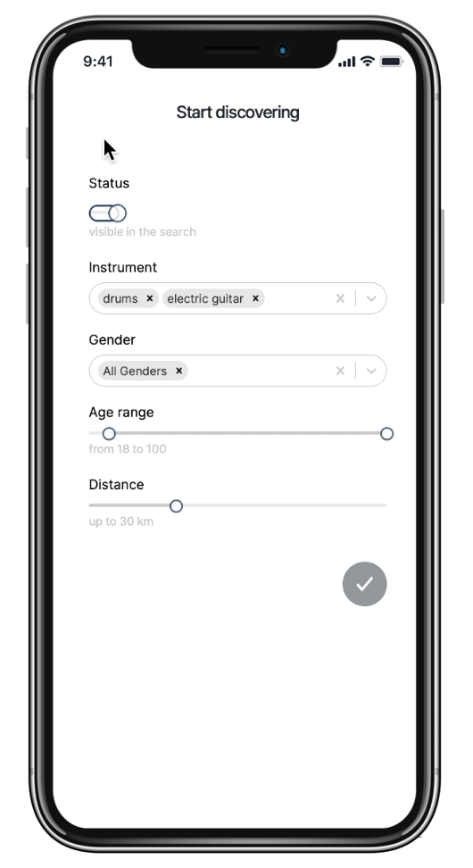 | 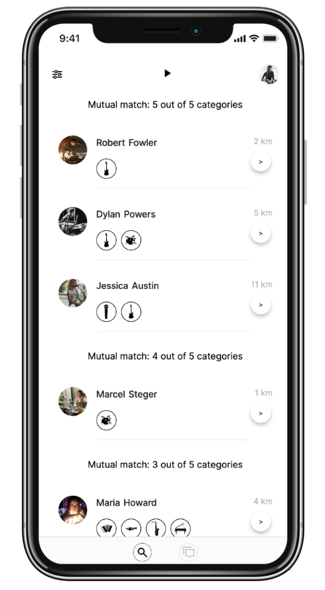 |

| Swiping Mode                                                     | Buddy Profile                                                      | Chat                                             |
| ---------------------------------------------------------------- | ------------------------------------------------------------------ | ------------------------------------------------ |
| 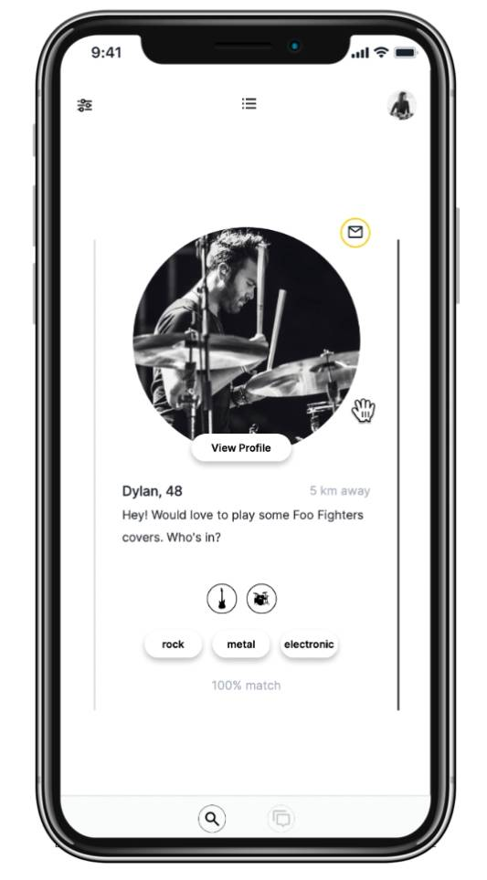 | 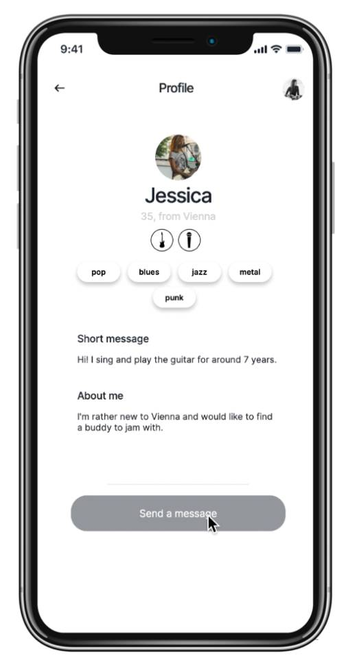 | 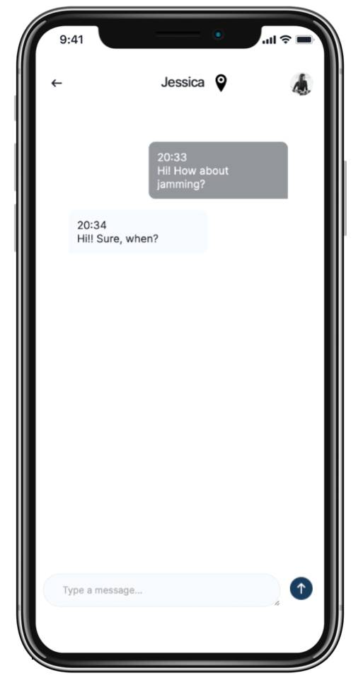 |

| Suggested Studio                                                | Tablet                                               | Desktop                                               |
| --------------------------------------------------------------- | ---------------------------------------------------- | ----------------------------------------------------- |
| 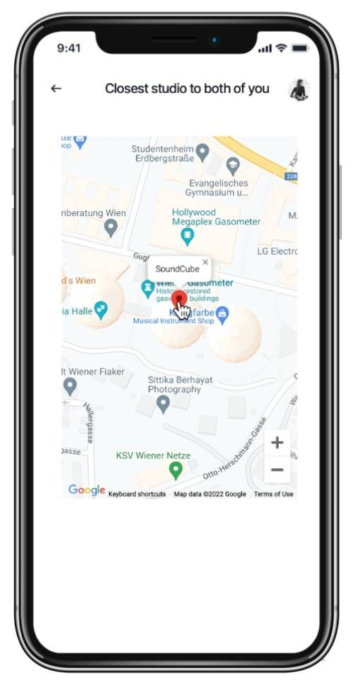 | 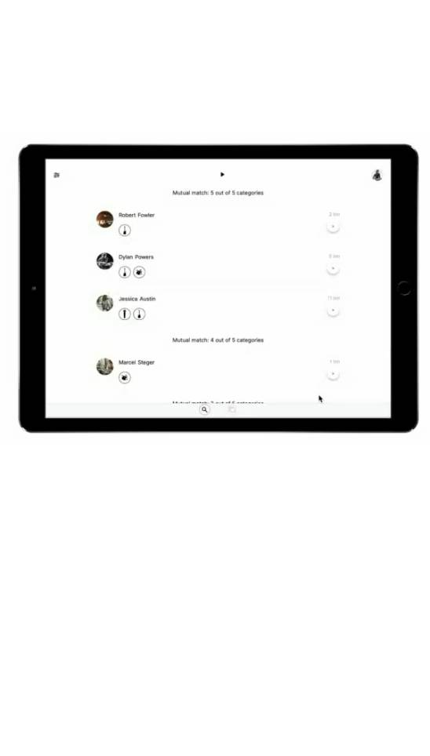 |  |

### Multi-Step Registration Form

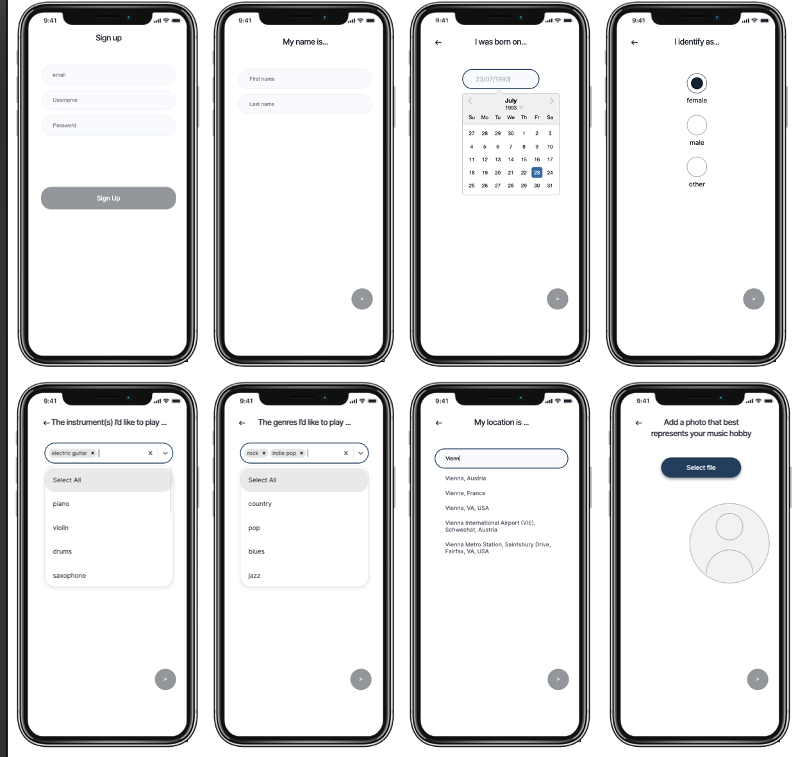

### Customer Journey and Design in Figma

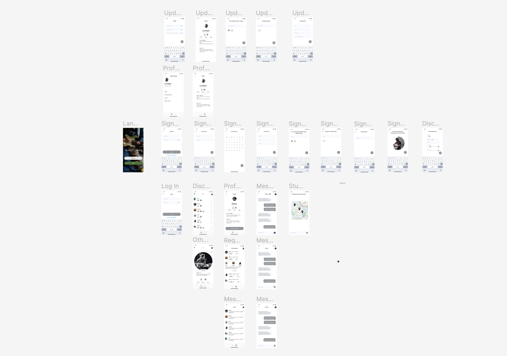

### Database Schema in DrawSQL

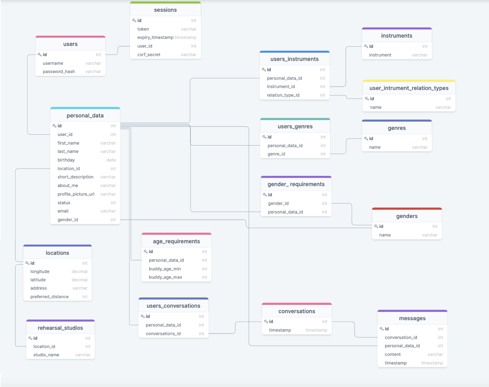

## Technologies

- Next.js
- TypeScript
- JavaScript
- PostgreSQL
- Emotion for CSS-in-JSX
- Jest for unit testing
- Playwright for end-to-end testing
- [Figma](https://www.figma.com/file/TTg7PvwhXPdrNe1z7SCG3s/Final-project?node-id=0%3A1)
- [DrawSQL](https://drawsql.app/my-own-team-1/diagrams/final-project#)
- Heroku Deployment
- Google API (Autocomplete, Maps)
- Cloudinary

## Setup instructions

Clone the repository and install all dependencies

```bash
git clone https://github.com/anzhlnk/easy-jam-app-upleveled-final-project.git
cd easy-jam-app-upleveled-final-project
yarn
```

## Setup the database by downloading and installing PostgreSQL

- Create a user and a database
- Create a .env file. Check .env.example file to see what info should be provided
- Copy the environment variables from .env-example into .env
- Replace the placeholders xxxxx with your username, password and name of the database
- Install dotenv-cli with yarn add dotenv-cli
- Run the migrations with yarn migrate up
- Start the server by running yarn dev
