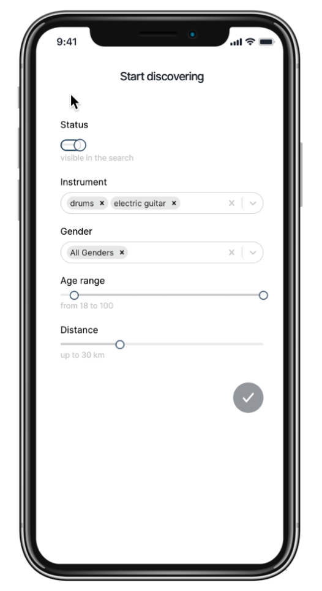

# EASYJAM <br/>Web application for finding a like-minded person to jam with based on instruments, genres, gender, age and distance

## Description

Go through the list of matching results or jump into a swiping mode. Update searching criteria. Switch off the visibility status not to be displayed in the searching results. Check other users profiles and update yours at any time. Start a conversation and check the suggested closest rehearsal studio for 2 users.

The deployed version can be found [here](https://easy-jam.herokuapp.com).

## Functionalities

- Multi-step registration form
- User authentication (registration and login)
- User authorisation (API only allows the account owner to modify or delete info)
- Logout, user info update and user delete
- CSRF mitigation using one of the token validation techniques suggested by OWASP
- Mutual matching based on user profiles (2-step process in PostgreSQL)
- 2 Discovery modes (list view and swiping mode)
- Chat built with Ably
- Suggestion of the closest rehearsal studio for 2 users
- Possibility to check other users’ profiles, keep yours up to date and update profile’s visibility status

## Technologies

- Next.js
- TypeScript
- JavaScript
- PostgreSQL
- Emotion for CSS-in-JSX
- Jest for unit testing
- Playwright for end-to-end testing
- FIGMA
- DrawSQL
- Heroku Deployment
- Google API (Autocomplete, Maps)
- Cloudinary

## Setup instructions

Clone the repository and install all dependencies

```bash
git clone https://github.com/anzhlnk/easy-jam-app-upleveled-final-project.git
cd easy-jam-app-upleveled-final-project
yarn
```

## Setup the database by downloading and installing PostgreSQL

- Create a user and a database
- Create a .env file. Check .env.example file to see what info should be provided
- Copy the environment variables from .env-example into .env
- Replace the placeholders xxxxx with your username, password and name of the database
- Install dotenv-cli with yarn add dotenv-cli
- Run the migrations with yarn migrate up
- Start the server by running yarn dev

## Deploy on Heroku

- Sign up at Heroku: https://www.heroku.com/.
- Create a new App
- Choose a name and select the "Europe" Region
- Click "Connect to GitHub"
- Search for your repository and click on "Connect"
- Click on "Enable Automatic Deploys"
- Go back to the Overview tab and click on "Configure Add-On"
- Search for "Postgres" and select "Heroku Postgres"
- Trigger a deploy by pushing your repo to GitHub

## Screenshots

| Landing page                               | Filters                        | List of Results                                    |
| ------------------------------------------ | ------------------------------ | -------------------------------------------------- |
|  |  |  |

| Swiping Mode                               | Buddy Profile                                | Chat                     |
| ------------------------------------------ | -------------------------------------------- | ------------------------ |
|  |  |  |

| Suggested Studio                        | Tablet      | Desktop      |
| --------------------------------------- | ----------- | ------------ |
|  |  |  |
